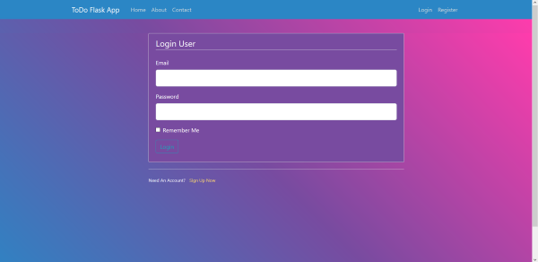

# Readme.md

This repo contains code for a ToDo app using Flask.
the features are as follows:

1. User Account Management using Database(Sqlite)
2. Updating Accounts
3. Added Account Profile pic functionality
4. Updating a List
5. Added Css file to make it visually appealing

Llibraries Used:

1. Flask

Possible Improvements:

1. Forgotten Password
2. Pagination

## Screenshots

Welcome Screen

Login Screen

Registration Screen

ToDo Lists Display Screen

